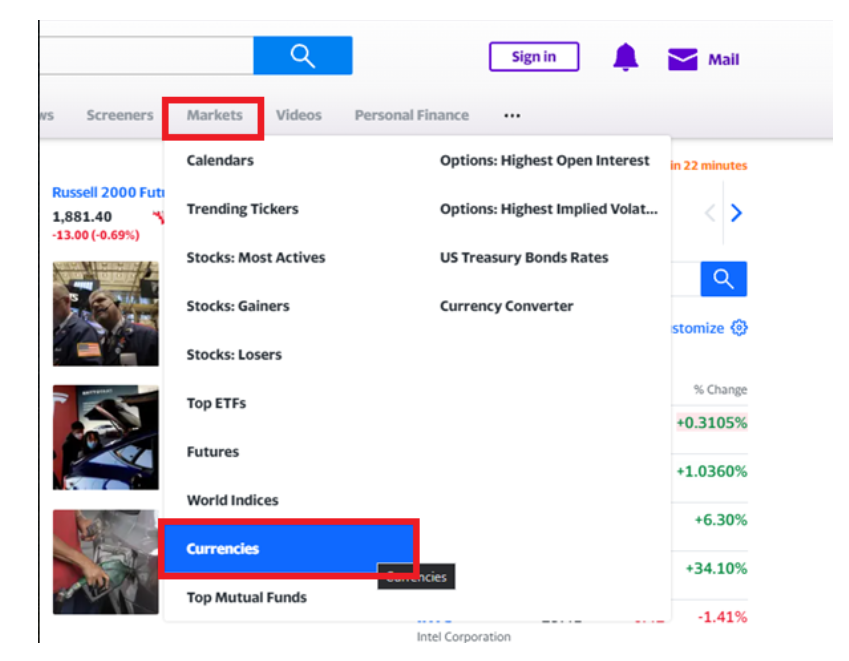
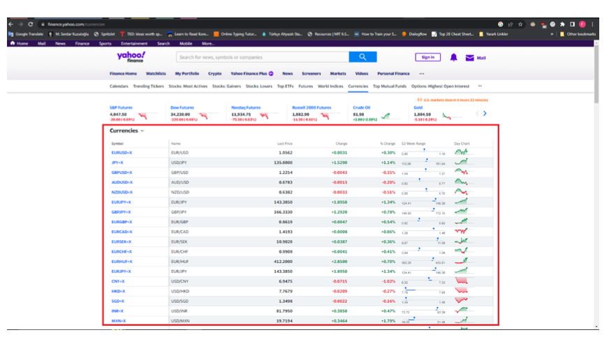
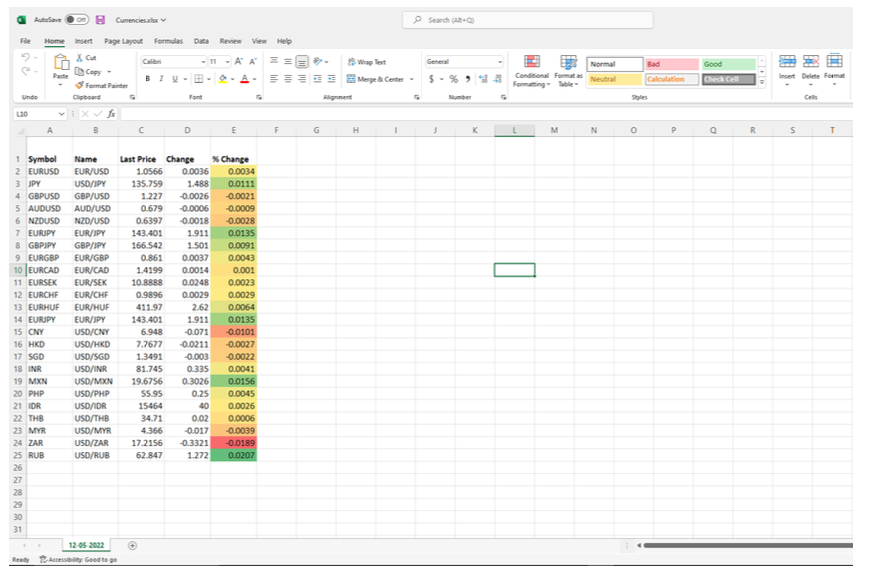
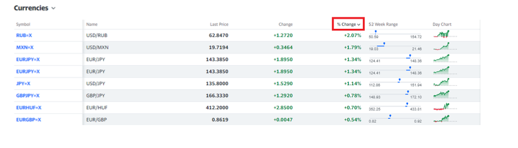
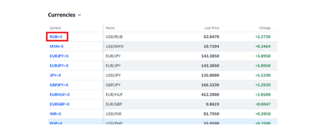
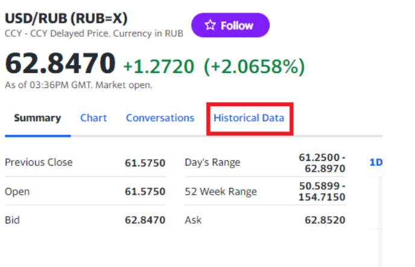
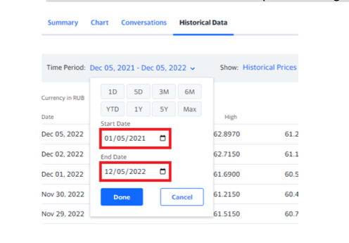
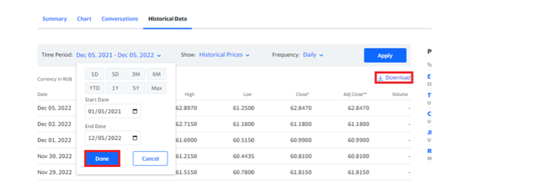
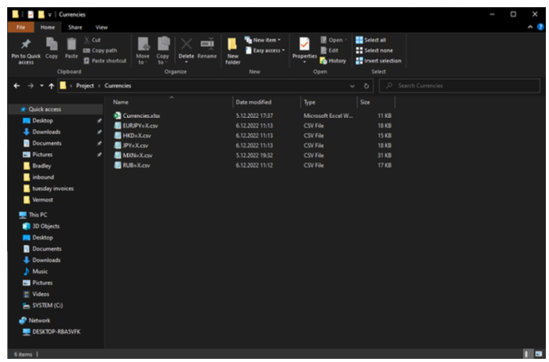

# Case Study

In this case study you’re going to be asked to automate fetching financial data from yahoo finance web page. This project requires web and excel automation. Implement your solutions using Python 3.9.5 and provide requirements.txt file in the project folder. Try to follow best practices to write clean code. You can use any Python packages you need. 

## Steps:

1. Open https://finance.yahoo.com/ page

2. Navigate to currencies page.
<figure>

</figure>

3. Extract Currencies table (except 52 Week Range and Day Chart columns) and write into excel file. Cut “=X” string from Symbol column Filename: Currencies.xlsx Sheet Name: MM- DD-YYYY. Make header cells bold. Make all column widths 10.00(75pixels). Bonus: You can try to apply Green – Yellow – Red color scale to % Change column (not required, try this if you have additional time left for the project).

<figure>

</figure>

Your final spreadsheet should look like this: (Bonus is not required)

<figure>

</figure>

4. Click on % Change column and sort in descending order.

<figure>

</figure>

5. For top 5 currencies:

a. Click on symbol and navigate to currency page.

<figure>

</figure>

b. Click Historical Data

<figure>

</figure>

c. Change time periods; End Date should be current day. Start Date should be first day of current month. You can see an example of running script at 5 Dec 2022.
<figure>

</figure>

d. Click Done then Download the file.
<figure>

</figure>
e. Save all files into \Project\Currencies folder. Your code should be in \Project folder.

<figure>

</figure>